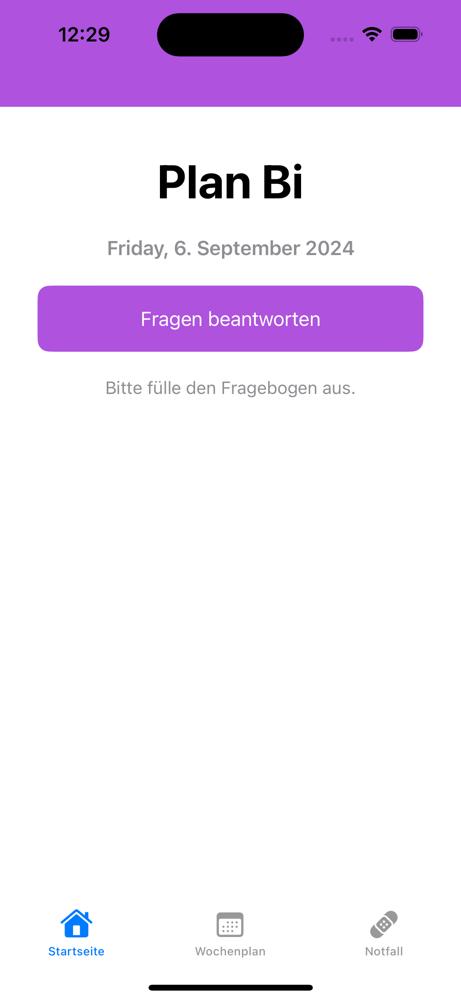

# plan-bi

### Abschlussprojekt von Batch15 des Swift Moduls beim Syntax Institut

### Über mich

  Hallo ihr da draußen ☀️  
  ich bin Benny, 43 Jahre alt, wohnhaft in Berlin und programmiere native Apps für Android und iOS als Junior Developer. 🧑‍💻

  Zur Zeit bin ich Studierender beim Syntax Institut und befinde mich in der Projektphase des vierten und somit letzten Moduls.

### Projektbeschreibung

  Bei meiner App, die mein Abschlussprojekt in der Swiftprogrammierung darstellt, handelt es sich um eine Health App. Sie dient Menschen, die betroffen sind von der bipolaren Erkrankung, ihren Alltag besser zu strukturieren.

### Features

  Wenn die App geöffnet wird, wird ein Quiz angezeigt, anhand dessen man aktivierende oder beruhigende Events angezeigt bekommt.
  Es können vorgeschlagene Events ausgewählt werden und eigene Events ertsellt werden, die eine zeitliche Komponente besitzen, die dann wie bei einer toDo Liste gecheckt werden können. Die Nutzer meiner App können sich über Notifications an die Events erinnern lassen.

  Um die Nutzer zu bestärken, dass es ihnen besser gehen kann, gibt es eine View mit Affirmationen, die eine positive Message vermitteln sollen.

### Technische Komponenten

Für die Datenspeicherung nutze ich CoreData. Die Architektur entspricht MVVM und Services API Service und Repository.

### Screenshots

  Hier der erste View meiner App als Screenshot:

  

    
  

### Design

  Hier ein erster Logo-Entwurf:

  

    
  

